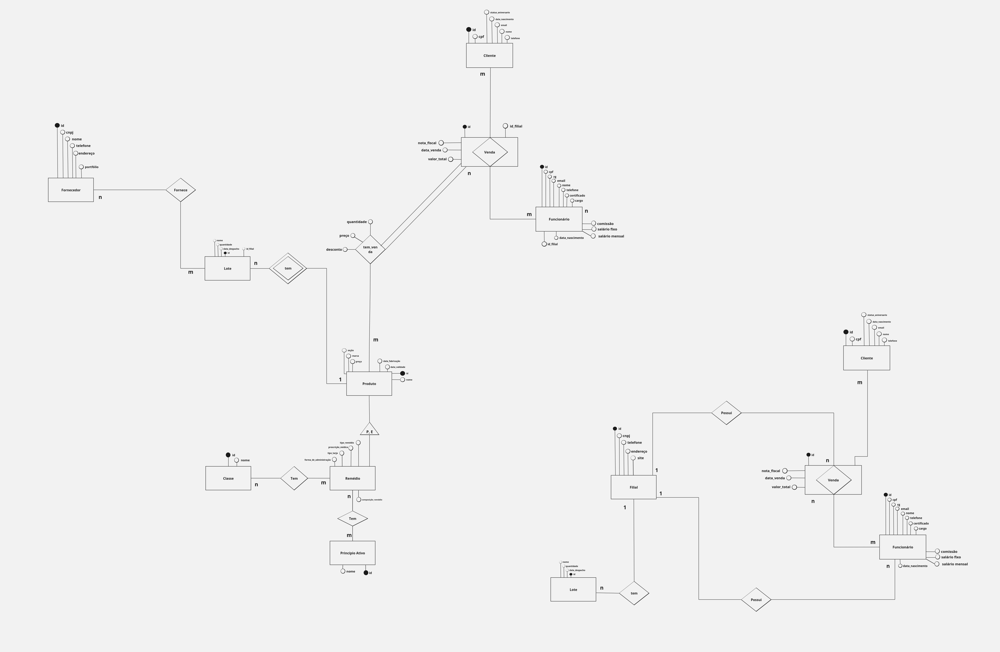
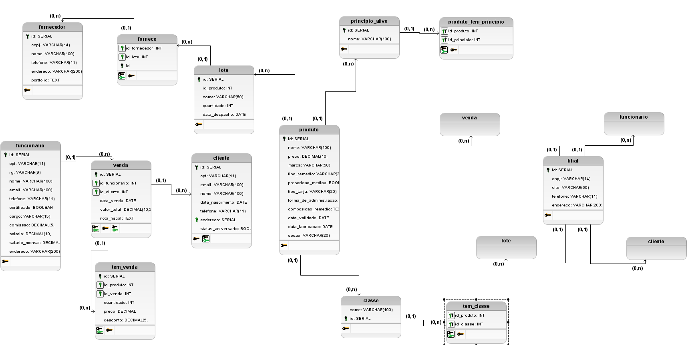
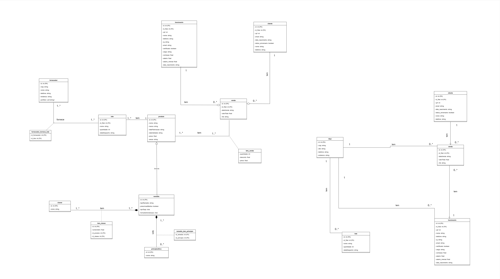

# DB-Modeling: Sistema para Filiais de Redes Farmacêuticas

## Descrição

Uma rede farmacêutica chamada LAV abriu diversas filiais espalhadas pelo Brasil. Além do nome, a rede também possui um ID, CNPJ e um site.

### Filiais

Cada filial da rede possui:
- Um número exclusivo de identificação
- Telefone
- Endereço

### Funcionários

Os funcionários das filiais possuem:
- ID exclusivo
- CPF
- Nome
- Telefone
- Cargo
- Certificado(s)
- Salário

### Fornecedores

A rede farmacêutica mantém relações com fornecedores para abastecimento das filiais. Cada fornecedor possui:
- ID exclusivo
- CNPJ
- Nome
- Telefone
- Endereço
- Portfólio de produtos

### Produtos

Os produtos da farmácia incluem:
- ID exclusivo
- Nome
- Preço
- Marca
- Data de validade
- Data de fabricação

#### Tipos de Produtos

1. **Remédios**: 
   - ID exclusivo
   - Tipo: Original ou Genérico
   - Tarja: Indicando restrição de venda
   - Forma de fabricação
   - Prescrição médica: Com receita ou não
   - Composição
   - Forma de administração
   - Classe: Identificada por ID e nome

2. **Princípios Ativos**:
   - ID exclusivo
   - Nome

3. **Outros Produtos**:
   - Seções com informações sobre diferentes categorias, cada uma identificada por ID e nome.

### Clientes

Os funcionários atendem clientes. Cada cliente possui:
- CPF
- ID exclusivo
- Nome
- Telefone

Cada venda realizada armazena a data e o ID da venda para fins de emissão de relatórios e controle da rede farmacêutica.

---

## Regras de Negócio

As regras de negócio determinam como os processos da organização devem ser conduzidos, garantindo consistência e eficiência nas operações. Abaixo estão algumas das regras de negócio para o sistema:

- **Gestão Geral**: A matriz é responsável por monitorar e ser o núcleo estratégico das filiais.

- **Gestão das Filiais**: As filiais podem modificar as bases de lote, venda e funcionário. A matriz é responsável pelo restante do gerenciamento.

- **Gestão de Estoque**: 
  - Manter controle de estoque atualizado, alertando quando um produto estiver abaixo do mínimo necessário.
  - Reordenar produtos para priorizar a venda dos mais recentes, especialmente remédios.

- **Gestão de Vendas**: 
  - Registrar vendas associando-as a um funcionário e uma filial.
  - Aplicar descontos baseados em promoções ou fidelidade do cliente.

- **Gestão de Clientes**: 
  - Manter registros detalhados de clientes, incluindo histórico de compras.
  - Oferecer programas de fidelidade com benefícios baseados em histórico de compras e aniversários.

- **Controle de Acesso**: Diferentes níveis de acesso para funcionários com base em suas funções, garantindo a segurança dos dados sensíveis.

- **Relatórios Financeiros**: Gerar relatórios de vendas, lucros e despesas por filial para análise de desempenho e melhorias.

- **Rastreamento de Lotes de Produtos**: Monitorar os lotes de produtos desde o recebimento até a venda, garantindo rastreabilidade em caso de recall.

- **Gestão de Prescrições Médicas**: Associar vendas de medicamentos controlados a prescrições médicas, mantendo um registro seguro e conforme com a legislação.

- **Análise de Tendências de Compra**: Utilizar dados históricos de vendas para identificar tendências e ajustar estoques e promoções.

- **Classe e Princípios Ativos**: 
  - Dados fornecidos pela ANVISA.
  - Ao cadastrar produtos, será possível selecionar as classes e princípios ativos usando "select boxes" com pesquisa.

- **Clientes Aniversariantes**: Enviar uma mensagem de felicitações ao cliente no seu aniversário, oferecendo 30% de desconto na primeira compra do dia.

- **Cadastro de Fornecedores**: Os fornecedores se cadastram fornecendo selos de garantia de qualidade, além de dados como endereço e telefone.

---

Esse modelo pode servir como base para implementar um sistema robusto de gestão para uma rede farmacêutica, abrangendo desde o controle de estoque até o gerenciamento de clientes e fornecedores.

## DER (Diagrama Entidade Relacionamento)

Um DER, ou Diagrama de Entidade e Relacionamento, é uma representação gráfica de um modelo de dados. Ele é usado para descrever as entidades, atributos e relacionamentos entre os dados em um banco de dados. Nesse caso, realizamos um DER baseado na proposta de uma de um sistema de controle e venda de produtos farmacêuticos a partir das filiais de uma determinada rede farmacêutica:



### Dicionário de Dados

O dicionário é um recurso que contém palavras organizadas em ordem alfabética, cada uma acompanhada de informações sobre o significado, pronúncia, uso e, em alguns casos, origem. A principal utilidade de um dicionário é fornecer definições claras e compreensíveis das palavras, ajudando as pessoas a entenderem o significado e o contexto de termos específicos em uma língua. Dado isso, foi elaborado o seguinte dicionário de dados, de modo a facilitar a leitura do DER.


#### Dicionário Entidade & Relacionamento

Logo abaixo, tem-se todas as informações sobre as Entidades e seus respectivos relacionamentos. Essas informações estão disponíveis para facilitar o entendimento da Modelagem de Dados.

## Entidade e Relacionamentos

| **Entidade**       | **Relacionamento C.** | **Nome do Relac.** | **Descrição**                                                                 |
|-------------------|----------------------|-------------------|-------------------------------------------------------------------------------|
| Filial            | Funcionário          | Possui            | Uma filial possui N funcionários                                              |
| Filial            | Lote                 | Fornece           | Toda filial recebe um lote de produtos                                        |
| Filial            | Venda                | Possui            | Toda filial tem vendas de produtos                                            |
| Fornecedor        | Lote                 | Fornece           | Fornecedor se encarrega de fornecer um lote de produtos para o fluxo de mercadorias |
| Produto           | Venda                | item_venda        | Na venda de um produto, temos informações sobre todos os itens vendidos       |
| Produto           | Lote                 | Tem               | Todo produto faz parte de um ou mais lotes de produtos                        |
| Funcionário       | Filial               | Possui            | Uma filial possui N funcionários                                              |
| Funcionário       | Cliente              | Venda             | Um cliente é atendido por um funcionário para realizar a compra               |
| Funcionário       | Venda                | Venda             | Um funcionário realiza vendas para um cliente                                 |
| Cliente           | Funcionário          | Venda             | Um cliente é atendido por um funcionário para realizar a compra               |
| Cliente           | Venda                | Venda             | Na venda de um produto, temos um cliente comprador                            |
| Venda             | Cliente              | Venda             | Na venda de um produto, temos um cliente comprador                            |
| Venda             | Filial               | Possui            | Toda venda faz parte de uma filial                                            |
| Princípio ativo   | Remédio              | Tem               | Um remédio possui vários princípios ativos                                    |
| Classe            | Remédio              | Tem               | Um remédio faz parte de uma ou mais classes, e uma classe pode estar em vários remédios |
| Remédio           | Princípio_ativo      | Tem               | Um remédio possui vários princípios ativos                                    |
| Remédio           | Classe               | Tem               | Um remédio faz parte de uma ou mais classes, e uma classe pode estar em vários remédios |
| Lote              | Fornecedor           | Fornece           | Fornecedor se encarrega de fornecer um lote de produtos para obter lucro      |
| Lote              | Produto              | Tem               | Todo produto faz parte de um ou mais lotes de produtos                        |
| Lote              | Filial               | Fornece           | Toda filial recebe um lote de produtos                                        |

## Dicionário de Tabelas & Atributos

Logo abaixo, estão todas as informações sobre as tabelas e seus respectivos atributos. Essas informações facilitam o entendimento da modelagem de dados.

### Tabela e Atributos - Filial

| **Atributo**          | **Nome do Atributo** | **Tipo do Atributo** | **Comprimento** | **Restrições**  | **Descrição**                                    |
|-----------------------|---------------------|---------------------|----------------|----------------|-------------------------------------------------|
| ID da Filial          | id                  | Int                 | 4 bytes        | PK NOT NULL    | Chave primária de uma filial                    |
| CNPJ da Filial        | cnpj                | Char                | 14 bytes       | UNIQUE         | Número designado pela Receita Federal           |
| Telefone da Filial    | telefone            | Char                | 11 bytes       |                | Telefone comercial da filial                    |
| Endereço da Filial    | endereco            | Varchar             | 200 bytes      |                | Endereço da localidade da filial                |
| Site da Filial        | site                | Varchar             | 50 bytes       |                | Site para compras online de uma farmácia        |


### Tabela e Atributos - Funcionário

| **Atributo**               | **Nome do Atributo** | **Tipo do Atributo** | **Comprimento** | **Restrições**      | **Descrição**                                                                                |
|----------------------------|---------------------|---------------------|----------------|---------------------|----------------------------------------------------------------------------------------------|
| ID do Funcionário          | id                  | Int                 | 4 bytes        | PK NOT NULL         | Chave primária de um funcionário.                                                            |
| CPF do Funcionário         | cpf                 | Char                | 11 bytes       | UNIQUE              | Número de documento que identifica o contribuinte perante a Receita Federal.                 |
| RG do Funcionário          | rg                  | Char                | 9 bytes        | UNIQUE              | Número de documento que identifica o contribuinte perante a SSP.                             |
| Nome do Funcionário        | nome                | Varchar             | 100 bytes      | NOT NULL            | Nome completo do funcionário.                                                                |
| Email do Funcionário       | email               | Varchar             | 100 bytes      | UNIQUE              | Email do funcionário.                                                                        |
| Endereço do Funcionário    | endereco            | Varchar             | 200 bytes      | NOT NULL            | Endereço residencial do funcionário.                                                         |
| Telefone do Funcionário    | telefone            | Char                | 11 bytes       |                     | Número de telefone do funcionário.                                                           |
| Certificado do Funcionário | certificado         | Boolean             | 1 byte         | NOT NULL            | Certificado de curso do funcionário (1 se possui, 0 se não possui).                          |
| Cargo do Funcionário       | cargo               | Varchar             | 15 bytes       | NOT NULL            | Cargo do funcionário na empresa filial.                                                      |
| Comissão do Funcionário    | comissao            | Decimal             | 10 bytes       | NOT NULL            | Comissão fixa recebida pelo funcionário por produto vendido.                                 |
| Salário do Funcionário     | salario_fixo        | Money               | 8 bytes        | NOT NULL            | Salário fixo do funcionário.                                                                 |
| Salário Mensal do Funcionário | salario_mensal    | Money               | 8 bytes        | NOT NULL            | Salário mensal (calculado com a comissão) a ser recebido pelo funcionário.                   |
| ID da Filial               | id_filial           | Int                 | 4 bytes        | FK NOT NULL         | Chave estrangeira para a filial em que o funcionário trabalha.                               |

### Tabela e Atributos - Cliente

| **Atributo**           | **Nome do Atributo** | **Tipo do Atributo** | **Comprimento** | **Restrições**      | **Descrição**                                                                                |
|------------------------|---------------------|---------------------|----------------|---------------------|----------------------------------------------------------------------------------------------|
| ID do Cliente          | id                  | Int                 | 4 bytes        | PK NOT NULL         | Chave primária de um cliente.                                                                |
| CPF do Cliente         | cpf                 | Char                | 11 bytes       | UNIQUE              | Número do documento que identifica o contribuinte perante a Receita Federal.                 |
| Nome do Cliente        | nome                | Varchar             | 100 bytes      | NOT NULL            | Nome completo do cliente.                                                                    |
| Email do Cliente       | email               | Varchar             | 100 bytes      | UNIQUE              | Email do cliente.                                                                            |
| Data de Nascimento     | data_nascimento     | Date                | 4 bytes        |                     | Data de nascimento do cliente.                                                               |
| Endereço do Cliente    | endereco            | Varchar             | 200 bytes      |                     | Endereço do cliente.                                                                         |
| Aniversário            | status_aniversario  | Boolean             | 1 byte         |                     | Variável booleana que marca o aniversário do cliente (1 é aniversário, 0 não é).             |
| Telefone do Cliente    | telefone            | Text                | 11 bytes       |                     | Telefone do cliente.                                                                         |

### Tabela e Atributos - Produto

| **Atributo**                   | **Nome do Atributo**       | **Tipo do Atributo** | **Comprimento** | **Restrições**      | **Descrição**                                                                                     |
|--------------------------------|---------------------------|---------------------|----------------|---------------------|---------------------------------------------------------------------------------------------------|
| ID do Produto                  | id                        | Int                 | 4 bytes        | PK NOT NULL         | Chave primária de um produto.                                                                     |
| Nome do Produto                | nome                      | Varchar             | 100 bytes      | NOT NULL            | Nome de um produto da farmácia.                                                                   |
| Preço do Produto               | preco                     | Money               | 8 bytes        | NOT NULL            | Preço para a compra de um produto da farmácia.                                                    |
| Marca de um Produto            | marca                     | Varchar             | 50 bytes       | NOT NULL            | Marca que criou o produto.                                                                        |
| Tipo de Remédio                | tipo_remedio              | Varchar             | 20 bytes       |                     | Tipo que caracteriza o remédio, como Antibiótico, Analgésico, etc.                                |
| Prescrição Médica de um Remédio | prescricao_medica         | Boolean             | 1 byte         |                     | Atributo booleano para indicar se o produto necessita de receita.                                 |
| Tarja de Remédio               | tipo_tarja                | Varchar             | 20 bytes       |                     | As cores das tarjas indicam a classificação de venda do medicamento.                              |
| Forma de Administração         | forma_de_administracao    | Varchar             | 50 bytes       |                     | Forma de uso do remédio, como oral, injeção, etc.                                                 |
| Composição do Remédio          | composicao_remedio        | Text                | Variável       |                     | Indica se o remédio é original ou genérico.                                                       |
| Data de Validade do Produto    | data_validade             | Date                | 4 bytes        | NOT NULL            | Data de validade do produto.                                                                      |
| Data de Fabricação do Produto  | data_fabricacao           | Date                | 4 bytes        | NOT NULL            | Data em que o produto foi criado.                                                                 |
| Seção de Produto               | secao                     | Varchar             | 10 bytes       | NOT NULL            | Seção onde o produto está armazenado na filial.                                                   |

### Tabela e Atributos - Princípio Ativo

| **Atributo**           | **Nome do Atributo** | **Tipo do Atributo** | **Comprimento** | **Restrições**      | **Descrição**                                                                                |
|------------------------|---------------------|---------------------|----------------|---------------------|----------------------------------------------------------------------------------------------|
| ID do Princípio Ativo  | id                  | Int                 | 4 bytes        | PK NOT NULL         | Chave primária do princípio ativo de um remédio.                                             |
| Nome do Princípio Ativo | nome                | Varchar             | 100 bytes      | NOT NULL            | Nome do componente farmacologicamente ativo destinado a um medicamento presente em algum remédio. |

### Tabela e Atributos - tem_venda

| **Atributo**               | **Nome do Atributo**   | **Tipo do Atributo** | **Comprimento** | **Restrições**      | **Descrição**                                                                                     |
|----------------------------|-----------------------|---------------------|----------------|---------------------|---------------------------------------------------------------------------------------------------|
| ID do item_venda           | id                    | Int                 | 4 bytes        | PK NOT NULL         | Chave primária de um item_venda.                                                                  |
| ID do Produto              | id_produto            | Int                 | 4 bytes        | FK NOT NULL         | Chave estrangeira do produto envolvido na venda.                                                  |
| ID da Venda                | id_venda              | Int                 | 4 bytes        | FK NOT NULL         | Chave estrangeira da venda correspondente.                                                        |
| Quantidade                 | quantidade            | Int                 | 4 bytes        | NOT NULL            | Quantidade vendida de um determinado produto.                                                     |
| Preço                      | preco                 | Money               | 8 bytes        | NOT NULL            | Valor total da quantidade vendida do produto.                                                     |
| Desconto                   | desconto              | Decimal             | 10 bytes       | NOT NULL            | Valor referente ao desconto aplicado na compra de determinado produto.                            |

### Tabela e Atributos - Fornece

| **Atributo**           | **Nome do Atributo**   | **Tipo do Atributo** | **Comprimento** | **Restrições**      | **Descrição**                                                                                     |
|------------------------|-----------------------|---------------------|----------------|---------------------|---------------------------------------------------------------------------------------------------|
| ID da Tabela           | fornece               | Int                 | 4 bytes        | PK NOT NULL         | Chave primária para identificar o fornecimento de um lote de produtos.                           |
| ID do Fornecedor       | id_fornecedor         | Int                 | 4 bytes        | FK NOT NULL         | Chave estrangeira para relacionar o fornecedor ao lote do produto.                               |
| ID do Produto          | id_produto            | Int                 | 4 bytes        | FK NOT NULL         | Chave estrangeira para relacionar o fornecedor ao lote do produto.                               |
| ID do Lote             | id_lote               | Int                 | 4 bytes        | FK NOT NULL         | Chave estrangeira para relacionar o fornecedor ao lote de um produto.                            |

### Tabela e Atributos - produto_tem_principio

| **Atributo**               | **Nome do Atributo**   | **Tipo do Atributo** | **Comprimento** | **Restrições**      | **Descrição**                                                                                     |
|----------------------------|-----------------------|---------------------|----------------|---------------------|---------------------------------------------------------------------------------------------------|
| ID do Produto e Princípio  |                       | Int                 | 0 bytes        | PK NOT NULL         | Chave primária composta.                                                                          |
| ID do Produto              | id_produto            | Int                 | 4 bytes        | FK NOT NULL         | Chave estrangeira do produto para relacionar com o princípio.                                     |
| ID do Princípio            | id_principio          | Int                 | 4 bytes        | FK NOT NULL         | Chave estrangeira do princípio para relacionar com o produto.                                     |

### Tabela e Atributos - tem_classe

| **Atributo**               | **Nome do Atributo**   | **Tipo do Atributo** | **Comprimento** | **Restrições**      | **Descrição**                                                                                     |
|----------------------------|-----------------------|---------------------|----------------|---------------------|---------------------------------------------------------------------------------------------------|
| ID do Produto e Classe     |                       | Int                 | 0 bytes        | PK NOT NULL         | Chave primária composta.                                                                          |
| ID do Produto              | id_produto            | Int                 | 4 bytes        | FK NOT NULL         | Chave estrangeira do produto para relacionar com a classe.                                        |
| ID da Classe               | id_classe             | Int                 | 4 bytes        | FK NOT NULL         | Chave estrangeira da classe para relacionar com o produto.                                        |

### Tabela e Atributos - Classe

| **Atributo**               | **Nome do Atributo**   | **Tipo do Atributo** | **Comprimento** | **Restrições**      | **Descrição**                                                                                     |
|----------------------------|-----------------------|---------------------|----------------|---------------------|---------------------------------------------------------------------------------------------------|
| ID da Classe               | id                    | Int                 | 4 bytes        | PK NOT NULL         | Chave primária da classe de um remédio.                                                           |
| Nome da Classe             | nome                  | Varchar             | 100 bytes      | NOT NULL            | Nome da classe terapêutica, que indica o tipo de doença ou condição para a qual o medicamento é indicado. |

### Tabela e Atributos - Fornecedor

| **Atributo**               | **Nome do Atributo**   | **Tipo do Atributo** | **Comprimento** | **Restrições**      | **Descrição**                                                                                     |
|----------------------------|-----------------------|---------------------|----------------|---------------------|---------------------------------------------------------------------------------------------------|
| ID do Fornecedor           | id                    | Int                 | 4 bytes        | PK NOT NULL         | Chave primária do fornecedor de uma rede farmacêutica.                                            |
| CNPJ do Fornecedor         | cnpj                  | Char                | 14 bytes       | UNIQUE              | Número designado pela Receita Federal na abertura da empresa.                                     |
| Nome do Fornecedor         | nome                  | Varchar             | 100 bytes      | NOT NULL            | Nome da empresa fornecedora de produtos.                                                          |
| Telefone do Fornecedor     | telefone              | Char                | 11 bytes       | NOT NULL            | Telefone para contato com o fornecedor.                                                           |
| Endereço do Fornecedor     | endereco              | Varchar             | 200 bytes      | NOT NULL            | Endereço correspondente à localização da empresa fornecedora.                                     |
| Portfólio do Fornecedor    | portfolio             | Texto               | Variável       | NOT NULL            | Lista de produtos fornecidos pela empresa.                                                        |

### Tabela e Atributos - Venda

| **Atributo**               | **Nome do Atributo**   | **Tipo do Atributo** | **Comprimento** | **Restrições**      | **Descrição**                                                                                     |
|----------------------------|-----------------------|---------------------|----------------|---------------------|---------------------------------------------------------------------------------------------------|
| ID da Venda                | id                    | Int                 | 4 bytes        | PK NOT NULL         | Chave primária da venda.                                                                          |
| Data de Venda              | data_venda            | Date                | 4 bytes        | NOT NULL            | Data da venda realizada por um funcionário para um cliente.                                       |
| Valor Total da Venda       | valor_total           | Money               | 8 bytes        | NOT NULL            | Valor total dos produtos vendidos.                                                                |
| Nota Fiscal de Venda       | nfe                   | Texto               | Variável       | NOT NULL            | Nota fiscal emitida na venda para o cliente.                                                      |
| ID da Filial               | id_filial             | Int                 | 4 bytes        | FK NOT NULL         | Chave estrangeira para a filial onde a venda foi realizada.                                       |
| ID do Funcionário          | id_funcionario        | Int                 | 4 bytes        | FK NOT NULL         | Chave estrangeira para o funcionário que realizou a venda.                                        |
| ID do Cliente              | id_cliente            | Int                 | 4 bytes        | FK NOT NULL         | Chave estrangeira para o cliente que realizou a compra.                                           |

### Tabela e Atributos - Lote

| **Atributo**               | **Nome do Atributo**   | **Tipo do Atributo** | **Comprimento** | **Restrições**      | **Descrição**                                                                                     |
|----------------------------|-----------------------|---------------------|----------------|---------------------|---------------------------------------------------------------------------------------------------|
| ID do Lote                 | id                    | Int                 | 4 bytes        | PK NOT NULL         | Chave primária do lote de um produto.                                                             |
| Nome do Lote               | nome                  | Varchar             | 100 bytes      | NOT NULL            | Nome designado para o lote de produtos.                                                           |
| Quantidade do Lote         | quantidade            | Int                 | 4 bytes        | NOT NULL            | Quantidade de itens no lote.                                                                      |
| Data de Despacho           | data                  | Date                | 4 bytes        | NOT NULL            | Data de despacho de um lote para uma filial.                                                      |
| ID do Produto              | id_produto            | Int                 | 4 bytes        | FK NOT NULL         | Chave estrangeira do produto que compõe o lote.                                                   |
| ID da Filial               | id_filial             | Int                 | 4 bytes        | FK NOT NULL         | Chave estrangeira para a filial em que o lote pertence.                                           |


## Modelo Lógico

Um modelo lógico é uma representação gráfica de processos que descreve a teoria e o raciocínio de um programa. Ele estabelece a estrutura dos dados e seus relacionamentos, independentemente do banco de dados físico. Os componentes principais são entidades (coisas, pessoas ou conceitos), relacionamentos (associações entre entidades) e atributos (informações descritivas das entidades). O modelo lógico é uma ferramenta essencial na organização dos trabalhos de avaliação e pode ser desenvolvido independentemente do sistema de gerenciamento de banco de dados.



## Diagrama de Classes

Um diagrama de classe é uma representação gráfica que descreve a estrutura e as relações entre as classes em um sistema orientado a objetos. Ele ilustra as classes do sistema, seus atributos, métodos e como elas estão interconectadas. Sendo assim, dada o contexto de projeto, abaixo está o diagrama de classes referente ao sistema.




## Modelagem Física

### Tabelas - SQL

Os códigos SQL que criarão todas as tabelas com as suas respectivas características, de acordo com o modelo relacional do projeto estão abaixo:

```sql
-- Cria a tabela 'filial'
CREATE TABLE filial (
    id SERIAL,
    cnpj VARCHAR(14) UNIQUE,
    site VARCHAR(50),
    telefone VARCHAR(15),
    endereco VARCHAR(200),
    CONSTRAINT pk_id_filial PRIMARY KEY (id)
);

COMMENT ON TABLE filial IS 'Entidade do DER que representa uma filial.';
COMMENT ON COLUMN filial.id IS 'Chave primária de uma filial.';
COMMENT ON COLUMN filial.cnpj IS 'Número único designado pela Receita Federal na abertura legal de uma empresa.';
COMMENT ON COLUMN filial.site IS 'Site para compras online de uma farmácia.';
COMMENT ON COLUMN filial.telefone IS 'Telefone comercial da Filial.';
COMMENT ON COLUMN filial.endereco IS 'Endereço da localidade da filial.';

-- Cria a tabela 'fornecedor'
CREATE TABLE fornecedor (
    id SERIAL,
    cnpj CHAR(14) UNIQUE,
    nome VARCHAR(100) NOT NULL,
    telefone CHAR(11) NOT NULL,
    endereco VARCHAR(200),
    portfolio TEXT NOT NULL,
    CONSTRAINT pk_id_fornecedor PRIMARY KEY (id)
);

COMMENT ON TABLE fornecedor IS 'Entidade do DER que representa um fornecedor.';
COMMENT ON COLUMN fornecedor.id IS 'Chave primária de um fornecedor.';
COMMENT ON COLUMN fornecedor.cnpj IS 'Número único designado pela Receita Federal na abertura legal de uma empresa.';
COMMENT ON COLUMN fornecedor.nome IS 'Nome que se refere a empresa fornecedora de produtos.';
COMMENT ON COLUMN fornecedor.telefone IS 'Telefone para entrar em contato com o fornecedor.';
COMMENT ON COLUMN fornecedor.endereco IS 'Endereço correspondente a posição geográfica da empresa fornecedora.';
COMMENT ON COLUMN fornecedor.portfolio IS 'Portfólio se refere a lista de produtos que uma empresa fornecedora fornece.';

-- Cria a tabela 'funcionario' entidade do DER.
CREATE TABLE funcionario (
    id SERIAL,
    cpf CHAR(11) UNIQUE,
    rg CHAR(9) UNIQUE,
    nome CHAR(100) NOT NULL,
    email VARCHAR(100) UNIQUE, 
    telefone CHAR(11),
    certificado BOOLEAN NOT NULL,
    cargo VARCHAR(15) NOT NULL,
    comissao DECIMAL(5, 2) NOT NULL,
    salario_fixo MONEY NOT NULL CHECK (salario_fixo > CAST(0.00 AS MONEY)),
    salario_mensal MONEY NOT NULL,
    id_filial INT NOT NULL,
    endereco VARCHAR(200) NOT NULL,
    CONSTRAINT pk_id_funcionario PRIMARY KEY (id),
    CONSTRAINT fk_id_filial_in_funcionario FOREIGN KEY (id_filial) REFERENCES filial (id)
);

COMMENT ON TABLE funcionario IS 'Entidade do DER que representa um funcionário.';
COMMENT ON COLUMN funcionario.id IS 'Chave primária de um funcionário.';
COMMENT ON COLUMN funcionario.cpf IS 'Número de documento que identifica o contribuinte perante a Receita Federal.';
COMMENT ON COLUMN funcionario.rg IS 'Número de documento que identifica o contribuinte perante a SSP.';
COMMENT ON COLUMN funcionario.nome IS 'Nome completo do funcionário.';
COMMENT ON COLUMN funcionario.email IS 'E-mail do funcionário.';
COMMENT ON COLUMN funcionario.telefone IS 'Número de telefone do funcionário.';
COMMENT ON COLUMN funcionario.certificado IS 'Certificado de curso do funcionário (1 se ele possui e 0 se não possui).';
COMMENT ON COLUMN funcionario.cargo IS 'Cargo do funcionário na empresa filial.';
COMMENT ON COLUMN funcionario.comissao IS 'Comissão fixa recebida pelo funcionário por produto vendido, independente de qual seja.';
COMMENT ON COLUMN funcionario.salario_fixo IS 'Salário fixo do funcionário.';
COMMENT ON COLUMN funcionario.salario_mensal IS 'Salário mensal (calculado com a comissão) a ser recebido pelo funcionário.';
COMMENT ON COLUMN funcionario.id_filial IS 'Chave estrangeira para a filial em que o funcionário trabalha.';
COMMENT ON COLUMN funcionario.endereco IS 'Endereço residencial do funcionário.';

-- Cria a tabela 'cliente' entidade do DER.
CREATE TABLE cliente (
    id SERIAL,
    cpf CHAR(11) UNIQUE,
    email VARCHAR(100) UNIQUE, 
    nome VARCHAR(100) NOT NULL,
    data_nascimento DATE,
    telefone CHAR(11),
    endereco VARCHAR(200),
    status_aniversario BOOL DEFAULT FALSE, 
    CONSTRAINT pk_id_cliente PRIMARY KEY (id)
);

COMMENT ON TABLE cliente IS 'Entidade do DER que representa um cliente.';
COMMENT ON COLUMN cliente.id IS 'Chave primária de um cliente.';
COMMENT ON COLUMN cliente.cpf IS 'Número do documento que identifica o contribuinte perante a Receita Federal.';
COMMENT ON COLUMN cliente.email IS 'Email do cliente.';
COMMENT ON COLUMN cliente.nome IS 'Nome completo do cliente.';
COMMENT ON COLUMN cliente.data_nascimento IS 'Data de nascimento do cliente.';
COMMENT ON COLUMN cliente.telefone IS 'Telefone do cliente.';
COMMENT ON COLUMN cliente.endereco IS 'Endereço do cliente.';
COMMENT ON COLUMN cliente.status_aniversario IS 'Verifica se é aniversário do cliente.';

-- Cria a tabela 'venda' entidade do DER.
CREATE TABLE venda (
    id SERIAL,
    id_funcionario INT NOT NULL,
    id_cliente INT NOT NULL,
    data_venda DATE NOT NULL DEFAULT CURRENT_DATE,
    valor_total MONEY NOT NULL,
    nota_fiscal TEXT NOT NULL,
    id_filial INT NOT NULL,
    CONSTRAINT pk_id_venda PRIMARY KEY (id),
    CONSTRAINT fk_id_funcionario_in_venda FOREIGN KEY (id_funcionario) REFERENCES funcionario (id),
    CONSTRAINT fk_id_cliente_in_venda FOREIGN KEY (id_cliente) REFERENCES cliente (id),
    CONSTRAINT fk_id_filial_in_venda FOREIGN KEY (id_filial) REFERENCES filial (id)
);

COMMENT ON TABLE venda IS 'Entidade do DER que representa uma venda.';
COMMENT ON COLUMN venda.id IS 'Chave primária de uma venda.';
COMMENT ON COLUMN venda.id_funcionario IS 'Chave estrangeira para o funcionário que realizou a venda.';
COMMENT ON COLUMN venda.id_cliente IS 'Chave estrangeira para o cliente que realizou a compra.';
COMMENT ON COLUMN venda.data_venda IS 'Data de quando ocorre uma venda de um funcionário para um cliente.';
COMMENT ON COLUMN venda.valor_total IS 'Valor total dos produtos vendidos por um funcionário.';
COMMENT ON COLUMN venda.nota_fiscal IS 'Nota fiscal emitida da venda para o cliente.';
COMMENT ON COLUMN venda.id_filial IS 'Chave estrangeira para a filial em que a venda pertence.';

-- Cria a tabela 'produto' entidade DER.
CREATE TABLE produto (
    id SERIAL,
    nome VARCHAR(100) NOT NULL,
    preco MONEY NOT NULL CHECK (preco > CAST(0.00 AS MONEY)),
    marca VARCHAR(50) NOT NULL,
    tipo_remedio VARCHAR(20),
    prescricao_medica BOOLEAN,
    tipo_tarja VARCHAR(20),
    forma_de_administracao VARCHAR(50),
    composicao_remedio TEXT,
    data_validade DATE NOT NULL,
    data_fabricacao DATE NOT NULL,
    secao VARCHAR(20) NOT NULL,
    CONSTRAINT pk_id_produto PRIMARY KEY (id)
);

COMMENT ON TABLE produto IS 'Entidade DER que representa um produto.';
COMMENT ON COLUMN produto.id IS 'Chave primária de um produto.';
COMMENT ON COLUMN produto.nome IS 'Nome de um produto da farmácia.';
COMMENT ON COLUMN produto.preco IS 'Preço para a compra de um produto da farmácia.';
COMMENT ON COLUMN produto.marca IS 'Marca que criou o produto.';
COMMENT ON COLUMN produto.tipo_remedio IS 'Tipo que caracteriza o remédio, como antibiótico ou analgésico.';
COMMENT ON COLUMN produto.prescricao_medica IS 'Atributo booleano para comprovar se o produto necessita de receita.';
COMMENT ON COLUMN produto.tipo_tarja IS 'As cores das tarjas indicam a classificação de venda do medicamento.';
COMMENT ON COLUMN produto.forma_de_administracao IS 'Diz respeito a forma de usar o remédio, se deve ser oral, injeção, etc.';
COMMENT ON COLUMN produto.composicao_remedio IS 'Serve para especificar se o remédio é original ou genérico.';
COMMENT ON COLUMN produto.data_validade IS 'Data de validade do produto antes de se tornar não utilizável.';
COMMENT ON COLUMN produto.data_fabricacao IS 'Data em que o produto foi criado.';
COMMENT ON COLUMN produto.secao IS 'O produto está guardado em alguma seção da filial.';

-- Cria a tabela 'lote' entidade do DER.
CREATE TABLE lote ( 
    id SERIAL,
    id_produto INT NOT NULL,
    nome VARCHAR(50) NOT NULL,
    quantidade INT NOT NULL,
    data_despacho DATE NOT NULL DEFAULT CURRENT_DATE, 
    id_filial INT NOT NULL,
    CONSTRAINT pk_composta_lote_produto PRIMARY KEY (id, id_produto), 
    FOREIGN KEY (id_produto) REFERENCES produto (id),
    CONSTRAINT fk_id_filial_in_lote FOREIGN KEY (id_filial) REFERENCES filial (id)
);

COMMENT ON TABLE lote IS 'Entidade do DER que representa um lote de produtos.';
COMMENT ON COLUMN lote.id IS 'Chave primária de um lote.';
COMMENT ON COLUMN lote.id_produto IS 'Chave estrangeira do produto que está dentro do lote.';
COMMENT ON COLUMN lote.nome IS 'Nome designado para o lote de produtos.';
COMMENT ON COLUMN lote.quantidade IS 'Quantidade de itens dentro de um lote de produtos.';
COMMENT ON COLUMN lote.data_despacho IS 'Data de despacho de uma entrega de determinado lote a uma filial.';
COMMENT ON COLUMN lote.id_filial IS 'Chave estrangeira para a filial em que o lote pertence.';

-- Cria a tabela 'principio_ativo' entidade do DER.
CREATE TABLE principio_ativo (
    id SERIAL,
    nome VARCHAR(100) NOT NULL,
    CONSTRAINT pk_id_principio_ativo PRIMARY KEY (id)
);

COMMENT ON TABLE principio_ativo IS 'Entidade do DER que representa um princípio ativo de medicamentos.';
COMMENT ON COLUMN principio_ativo.id IS 'Chave primária de um princípio ativo.';
COMMENT ON COLUMN principio_ativo.nome IS 'Nome do componente farmacologicamente ativo destinado a um medicamento.';

-- Cria a tabela 'tem_venda' que vem do relacionamento N-M entre [venda] e [produto].
CREATE TABLE tem_venda (
    id SERIAL,
    id_produto INT NOT NULL,
    id_venda INT NOT NULL,
    quantidade INT NOT NULL,
    preco MONEY NOT NULL,
    desconto DECIMAL(5, 2),
    CONSTRAINT pk_id_tem_venda PRIMARY KEY (id), 
    CONSTRAINT uq_produto_venda UNIQUE (id_produto, id_venda),
    CONSTRAINT fk_id_venda_in_tem_venda FOREIGN KEY (id_venda) REFERENCES venda (id),
    CONSTRAINT fk_id_produto_in_tem_venda FOREIGN KEY (id_produto) REFERENCES produto (id)
);

COMMENT ON TABLE tem_venda IS 'Tabela que vem do relacionamento N-M entre venda e produto.';
COMMENT ON COLUMN tem_venda.id IS 'Chave primária de um tem_venda.';
COMMENT ON COLUMN tem_venda.id_produto IS 'Chave estrangeira do produto, na qual passou por uma determinada venda.';
COMMENT ON COLUMN tem_venda.id_venda IS 'Chave estrangeira da venda, na qual vendeu determinada quantidade de um produto.';
COMMENT ON COLUMN tem_venda.quantidade IS 'Quantidade vendida de um determinado produto.';
COMMENT ON COLUMN tem_venda.preco IS 'Valor referente ao total de uma determinada quantidade de um produto.';
COMMENT ON COLUMN tem_venda.desconto IS 'Valor referente ao desconto na compra de determinado produto.';

-- Cria a tabela 'fornece' que vem do relacionamento N-M entre [fornecedor] e [lote].
CREATE TABLE fornece (
    id SERIAL,
    id_fornecedor INT NOT NULL,
	id_produto INT NOT NULL, 
    id_lote INT NOT NULL,
    CONSTRAINT pk_id_fornece PRIMARY KEY (id),
    CONSTRAINT fk_id_fornecedor_in_fornece FOREIGN KEY (id_fornecedor) REFERENCES fornecedor (id),
	CONSTRAINT fk_id_produto_in_fornece FOREIGN KEY (id_lote, id_produto) REFERENCES lote (id, id_produto)
);

COMMENT ON TABLE fornece IS 'Tabela que vem do relacionamento N-M entre fornecedor e lote.';
COMMENT ON COLUMN fornece.id IS 'Chave primária para identificar o fornecimento de um lote de produto de um fornecedor.';
COMMENT ON COLUMN fornece.id_fornecedor IS 'Chave estrangeira para relacionar o fornecedor a determinado lote de um produto.';
COMMENT ON COLUMN fornece.id_produto IS 'Chave estrangeira para relacionar o fornecedor a determinado lote de um produto.';
COMMENT ON COLUMN fornece.id_lote IS 'Chave estrangeira para relacionar o fornecedor a determinado lote de um produto.';

-- Cria a tabela 'produto_tem_principio' que vem do relacionamento N-M entre [produto] e [principio_ativo].
CREATE TABLE produto_tem_principio (
    id_produto INT NOT NULL,
    id_principio INT NOT NULL,
    CONSTRAINT pk_id_produto_tem_principio PRIMARY KEY (id_produto, id_principio),
    CONSTRAINT fk_id_produto_tem_principio FOREIGN KEY (id_produto) REFERENCES produto (id),
    CONSTRAINT fk_id_principio_tem_principio FOREIGN KEY (id_principio) REFERENCES principio_ativo (id)
);

COMMENT ON TABLE produto_tem_principio IS 'Tabela que vem do relacionamento N-M entre produto e princípio ativo.';
COMMENT ON COLUMN produto_tem_principio.id_produto IS 'Chave estrangeira do produto para relacionar com princípio.';
COMMENT ON COLUMN produto_tem_principio.id_principio IS 'Chave estrangeira do principio para relacionar com produto.';

-- Cria a tabela 'classe' entidade do DER.
CREATE TABLE classe (
    id SERIAL,
    nome VARCHAR(100),
    CONSTRAINT pk_id_classe PRIMARY KEY (id)
);

COMMENT ON TABLE classe IS 'Tabela que representa a classe terapêutica de um medicamento.';
COMMENT ON COLUMN classe.id IS 'Chave primária da classe de um remédio.';
COMMENT ON COLUMN classe.nome IS 'O nome da classe terapêutica de um medicamento, indica para que tipo de doença ou condição é indicado.';

-- Cria a tabela 'tem_classe' que vem do relacionamento N-M entre [produto] e [classe].
CREATE TABLE tem_classe(
    id_produto INT NOT NULL,
    id_classe INT NOT NULL,
    CONSTRAINT pk_id_tem_classe PRIMARY KEY (id_produto, id_classe),
    CONSTRAINT fk_id_produto_in_tem_classe FOREIGN KEY (id_produto) REFERENCES produto (id),
    CONSTRAINT fk_id_classe_in_tem_classe FOREIGN KEY (id_classe) REFERENCES classe (id)
);

COMMENT ON TABLE tem_classe IS 'Tabela que vem do relacionamento N-M entre produto e classe.';
COMMENT ON COLUMN tem_classe.id_produto IS 'Chave estrangeira do produto para relacionar com classe.';
COMMENT ON COLUMN tem_classe.id_classe IS 'Chave estrangeira de classe para
```

### Index - Melhoria de Consultas

A otimização das consultas no banco de dados é crucial para melhorar o desempenho e a eficiência das operações de busca. Duas estratégias principais de indexação são índices Hash e índices B-tree. Cada tipo tem suas vantagens específicas dependendo do tipo de consulta executada.


- **Como usar e porquê usar Index Hash:**

  Índices Hash são utilizados para operações de busca por igualdade. Eles oferecem uma performance de busca rápida e consistente, ideal para colunas com valores únicos como e-mail e telefone.

- **Como usar e porquê usar Index B-tree:**

  Índices B-tree são versáteis e suportam busca por igualdade, buscas de intervalo e ordenações. Eles são recomendados para a maioria das colunas, especialmente aquelas usadas em relações de chave estrangeira e consultas que envolvem ordenação ou intervalos de datas.

### Index - Hash

Índices Hash são recomendados para as seguintes colunas:

```sql
-- Buscas por email são essenciais para autenticação e identificação rápida de usuários, tornando índices Hash ideais para acelerar essas operações.

CREATE INDEX idx_hash_cliente_email ON cliente USING HASH (email);
CREATE INDEX idx_hash_funcionario_email ON funcionario USING HASH (email);

-- Operações podem envolver busca por número de telefone, especialmente em sistemas de atendimento ao cliente ou gestão de RH.

CREATE INDEX idx_hash_cliente_telefone ON cliente USING HASH (telefone);
CREATE INDEX idx_hash_funcionario_telefone ON funcionario USING HASH (telefone);
```

### Index - B-tree

Índices B-tree são recomendados para as seguintes colunas:

```sql
-- Facilita as consultas que buscam vendas em um determinado intervalo de tempo, seja um dia específico, mês, ano ou entre datas.

CREATE INDEX idx_btree_venda_data ON venda(data_venda);

-- Otimizar a busca por registros de atendimento em determinadas datas.

CREATE INDEX idx_btree_atende_data ON atende(data_atendimento);

-- Permite consultas rápidas para identificar produtos próximos do vencimento, facilitando ações de promoção, realocação ou descarte, essenciais na gestão de uma farmácia.

CREATE INDEX idx_btree_produto_validade ON produto(data_validade);

-- Pode ser útil para promoções baseadas em aniversário.

CREATE INDEX idx_btree_cliente_data_nascimento ON cliente(data_nascimento);

-- Nome de Fornecedor, Cliente e Funcionário para Buscas e Ordenações.

CREATE INDEX idx_btree_fornecedor_nome ON fornecedor(nome);
CREATE INDEX idx_btree_cliente_nome ON cliente(nome);
CREATE INDEX idx_btree_funcionario_nome ON funcionario(nome);

-- Filtros de busca em catálogos de produtos, especialmente em um contexto de e-commerce ou gestão de estoque.

CREATE INDEX idx_btree_produto_marca ON produto(marca);
CREATE INDEX idx_btree_produto_tipo ON produto(tipo_remedio);
```

### Peso - Index

Conhecer o peso dos índices em um banco de dados é crucial para otimizar o desempenho das consultas, gerenciar eficientemente o espaço de armazenamento e entender a sobrecarga em operações de escrita. Índices eficazes melhoram significativamente as leituras, mas também podem consumir recursos consideráveis, impactando o planejamento de capacidade e a manutenção do sistema.

A análise do tamanho dos índices auxilia na previsão de necessidades futuras de hardware e na otimização de recursos, garantindo escalabilidade e eficiência operacional conforme o volume de dados aumenta.

| **Index**               | **Ocupação (bytes)** |
|-------------------------|---------------------|
| filial                  | 38                  |
| fornecedor              | 98                  |
| funcionario             | 269                 |
| cliente                 | 250                 |
| venda                   | 70                  |
| produto                 | 93                  |
| lote                    | 32                  |
| principio_ativo         | 14                  |
| atende                  | 14                  |
| tem_venda               | 60                  |
| fornece                 | 46                  |
| produto_tem_principio   | 32                  |
| classe                  | 14                  |
| tem_classe              | 32                  |
| **Total**               | **1062**            |

*Tabela 1: Pesos totais de cada Index implementado*

## Ocupação em Disco

A análise da ocupação em disco em relação à modelagem de banco de dados é crucial por várias razões. Primeiramente, uma modelagem eficiente do banco de dados otimiza o espaço em disco, importante em ambientes onde armazenamento é limitado ou caro. Além disso, um banco de dados bem projetado melhora o desempenho das consultas e transações, reduzindo operações de I/O e minimizando tempo de acesso aos dados. Isso também contribui para a escalabilidade do banco de dados, lidando melhor com o crescimento dos dados ao longo do tempo. 

Uma modelagem que considera a ocupação em disco facilita operações de manutenção e backup, além de simplificar a administração do banco de dados. Identificar áreas de subutilização de recursos ajuda a economizar recursos de hardware e reduzir custos operacionais. Em resumo, essa análise garante eficiência, desempenho, escalabilidade, facilidade de gerenciamento e economia de recursos no sistema de banco de dados.

### Ocupação Base da Modelagem

Aqui, neste tópico o objetivo é calcular o peso em bytes de cada tabela, de acordo com os tipos de dados usados, além de fazer estimativas e construir projeções de consumo de armazenamento. 

- Observação: a informação sobre ocupação em bytes de cada tipo de dado foi obtida diretamente da documentação do PostgreSQL.

#### Tabela Filial - Peso

| **Campo** | **Tipo** | **Ocupação (bytes)** |
|-----------|-----------|---------------------|
| id        | SERIAL    | 4                   |
| cnpj      | CHAR(14)  | 14                  |
| telefone  | CHAR(11)  | 11                  |
| endereco  | VARCHAR(200) | 200              |
| site      | VARCHAR(50)  | 50               |
| **Total** | **Valor** | **279**             |

*Tabela 1: Peso da tabela Filial*

---

#### Tabela Fornecedor - Peso

| **Campo**   | **Tipo**    | **Ocupação (bytes)** |
|-------------|-------------|---------------------|
| id          | SERIAL      | 4                   |
| cnpj        | CHAR(14)    | 14                  |
| nome        | VARCHAR(100) | 100                |
| telefone    | CHAR(11)    | 11                  |
| endereco    | VARCHAR(200) | 200                |
| portfolio   | TEXT        | Variável            |
| **Total**   | **Valor**   | **329**             |

*Tabela 2: Peso da tabela Fornecedor*

---

#### Tabela Funcionário - Peso

| **Campo**       | **Tipo**    | **Ocupação (bytes)** |
|-----------------|-------------|---------------------|
| id              | SERIAL      | 4                   |
| cpf             | CHAR(11)    | 11                  |
| rg              | CHAR(9)     | 9                   |
| nome            | VARCHAR(100) | 100                |
| email           | VARCHAR(100) | 100                |
| telefone        | CHAR(11)    | 11                  |
| certificado     | BOOLEAN     | 1                   |
| cargo           | VARCHAR(15) | 15                  |
| comissao        | DECIMAL(5,2) | 10                 |
| salario_fixo    | MONEY       | 8                   |
| salario_mensal  | MONEY       | 8                   |
| id_filial       | INTEGER     | 4                   |
| **Total**       | **Valor**   | **281**             |

*Tabela 3: Peso da tabela Funcionário*

---

#### Tabela Cliente - Peso

| **Campo**          | **Tipo**    | **Ocupação (bytes)** |
|--------------------|-------------|---------------------|
| id                 | SERIAL      | 4                   |
| cpf                | CHAR(11)    | 11                  |
| nome               | VARCHAR(100) | 100                |
| email              | VARCHAR(100) | 100                |
| data_nascimento    | DATE        | 4                   |
| status_aniversario | BOOL        | 1                   |
| telefone           | CHAR(11)    | 11                  |
| **Total**          | **Valor**   | **231**             |

*Tabela 4: Peso da tabela Cliente*

---

#### Tabela Venda - Peso

| **Campo**       | **Tipo**    | **Ocupação (bytes)** |
|-----------------|-------------|---------------------|
| id              | SERIAL      | 4                   |
| id_funcionario  | INT         | 4                   |
| id_cliente      | INT         | 4                   |
| data_venda      | DATE        | 4                   |
| valor_total     | MONEY       | 8                   |
| nota_fiscal     | TEXT        | Variável            |
| id_filial       | INT         | 4                   |
| **Total**       | **Valor**   | **28**              |

*Tabela 5: Peso da tabela Venda*

---

#### Tabela Produto - Peso

| **Campo**                | **Tipo**    | **Ocupação (bytes)** |
|--------------------------|-------------|---------------------|
| id                       | SERIAL      | 4                   |
| nome                     | VARCHAR(100) | 100                |
| preco                    | MONEY       | 8                   |
| marca                    | VARCHAR(50) | 50                  |
| tipo_remedio             | VARCHAR(20) | 20                  |
| prescricao_medica        | BOOLEAN     | 1                   |
| tipo_tarja               | VARCHAR(20) | 20                  |
| forma_de_administracao   | VARCHAR(50) | 50                  |
| composicao_remedio       | TEXT        | Variável            |
| data_validade            | DATE        | 4                   |
| data_fabricacao          | DATE        | 4                   |
| secao                    | VARCHAR(10) | 10                  |
| **Total**                | **Valor**   | **271**             |

*Tabela 6: Peso da tabela Produto*

---

#### Tabela Lote - Peso

| **Campo**        | **Tipo**    | **Ocupação (bytes)** |
|------------------|-------------|---------------------|
| id               | SERIAL      | 4                   |
| id_produto       | INT         | 4                   |
| nome             | VARCHAR(100) | 100                |
| quantidade       | INT         | 4                   |
| data_despacho    | DATE        | 4                   |
| id_filial        | INT         | 4                   |
| **Total**        | **Valor**   | **120**             |

*Tabela 7: Peso da tabela Lote*

---

#### Tabela Principio_ativo - Peso

| **Campo**       | **Tipo**    | **Ocupação (bytes)** |
|-----------------|-------------|---------------------|
| id              | SERIAL      | 4                   |
| nome            | VARCHAR(100) | 100                |
| **Total**       | **Valor**   | **104**             |

*Tabela 8: Peso da tabela Principio_ativo*

---

#### Tabela Tem_venda - Peso

| **Campo**       | **Tipo**    | **Ocupação (bytes)** |
|-----------------|-------------|---------------------|
| id              | INT         | 4                   |
| id_venda        | INT         | 4                   |
| id_produto      | INT         | 4                   |
| quantidade      | INT         | 4                   |
| preco           | MONEY       | 8                   |
| desconto        | DECIMAL(5,2) | 10                 |
| **Total**       | **Valor**   | **34**              |

*Tabela 9: Peso da tabela Tem_venda*

---

#### Tabela Fornece - Peso

| **Campo**       | **Tipo**    | **Ocupação (bytes)** |
|-----------------|-------------|---------------------|
| id              | INT         | 4                   |
| id_fornecedor   | INT         | 4                   |
| id_lote         | INT         | 4                   |
| id_produto      | INT         | 4                   |
| **Total**       | **Valor**   | **16**              |

*Tabela 10: Peso da tabela Fornece*

---

#### Tabela Produto_tem_principio - Peso

| **Campo**       | **Tipo**    | **Ocupação (bytes)** |
|-----------------|-------------|---------------------|
| id              | INT         | 4                   |
| id_venda        | INT         | 4                   |
| id_principio    | INT         | 4                   |
| **Total**       | **Valor**   | **12**              |

*Tabela 11: Peso da tabela Produto_tem_principio*

---

#### Tabela Classe - Peso

| **Campo**       | **Tipo**    | **Ocupação (bytes)** |
|-----------------|-------------|---------------------|
| id              | INT         | 4                   |
| nome            | VARCHAR(100) | 100                |
| **Total**       | **Valor**   | **104**             |

*Tabela 12: Peso da tabela Classe*

---

#### Tabela Tem_classe - Peso

| **Campo**       | **Tipo**    | **Ocupação (bytes)** |
|-----------------|-------------|---------------------|
| id              | INT         | 4                   |
| id_produto      | INT         | 4                   |
| id_classe       | INT         | 4                   |
| **Total**       | **Valor**   | **12**              |

*Tabela 13: Peso da tabela Tem_classe*

---

#### Peso Total

Logo abaixo, segue-se uma tabela que relaciona a ocupação de cada tabela em bytes, no que diz respeito a pelo menos 1 única tupla, em relação ao total de ocupação da modelagem.

| **Tabela**             | **Ocupação (bytes)** |
|------------------------|---------------------|
| Filial                 | 279                 |
| Fornecedor             | 329                 |
| Funcionário            | 281                 |
| Cliente                | 231                 |
| Venda                  | 40                  |
| Produto                | 271                 |
| Lote                   | 120                 |
| Principio_ativo        | 104                 |
| Tem_venda              | 34                  |
| Fornece                | 16                  |
| Produto_tem_principio  | 12                  |
| Classe                 | 104                 |
| Tem_classe             | 12                  |
| **Total**              | **1833**            |

*Tabela 14: Pesos totais de cada tabela*

**Agora, somando-se o peso de pelo menos 1 tupla de cada tabela estima-se que o total seja:** 1906 bytes aproximadamente (não levando em consideração a ocupação dos tipos variáveis).


## Consulta/Relatórios

Consultas *SQL* de agregação são consultas que são usadas para calcular agregações de dados, como somas, médias e contagens. Essas consultas são úteis para obter uma visão geral de grandes conjuntos de dados.  
Um relatório em *SQL* é um conjunto de dados formatado e organizado para apresentação. Os relatórios do projeto servirão para o controle da empresa. Aqui, tem-se consultas simples sem análise performática das mesmas.

### Mensal

Abaixo estão as consultas mensais que julgamos ser de crucial importância de serem realizadas durante o mês, a fim de monitorar o desempenho e o dia a dia das filiais.

#### Relatório - Número total de remédios vendidos por classe no mês atual

```sql
SELECT c.nome AS nome_classe, SUM(tv.quantidade) AS quantidade_vendida
FROM tem_venda tv
JOIN venda v ON tv.id_venda = v.id
JOIN produto p ON tv.id_produto = p.id
JOIN tem_classe tc ON p.id = tc.id_produto
JOIN classe c ON tc.id_classe = c.id
WHERE EXTRACT(MONTH FROM v.data_venda) = EXTRACT(MONTH FROM CURRENT_DATE)
AND EXTRACT(YEAR FROM v.data_venda) = EXTRACT(YEAR FROM CURRENT_DATE)
GROUP BY c.nome
ORDER BY quantidade_vendida DESC;
```

#### Relatório - Relatório - Produto mais vendido em cada filial no mês atual

```sql
WITH vendas_mes_atual AS (
    SELECT
        v.id_filial,
        tv.id_produto,
        SUM(tv.quantidade) AS total_vendido
    FROM venda v
    JOIN tem_venda tv ON v.id = tv.id_venda
    WHERE EXTRACT(MONTH FROM v.data_venda) = EXTRACT(MONTH FROM CURRENT_DATE)
        AND EXTRACT(YEAR FROM v.data_venda) = EXTRACT(YEAR FROM CURRENT_DATE)
    GROUP BY v.id_filial, tv.id_produto
),
ranked_produtos AS (
    SELECT
        vma.id_filial,
        vma.id_produto,
        p.nome AS nome_produto,
        vma.total_vendido,
        RANK() OVER(PARTITION BY vma.id_filial ORDER BY vma.total_vendido DESC) AS rank
    FROM vendas_mes_atual vma
    JOIN produto p ON vma.id_produto = p.id
)
SELECT
    rp.id_filial,
    rp.nome_produto,
    rp.total_vendido
FROM ranked_produtos rp
WHERE rp.rank = 1;
```

#### Relatório - Quantidade total vendida de remédios por funcionário em cada filial no mês atual

```sql

SELECT
    f.id_filial,
    v.id_funcionario,
    f.nome AS nome_funcionario,
    SUM(tv.quantidade) AS total_remedios_vendidos
FROM venda v
JOIN tem_venda tv ON v.id = tv.id_venda
JOIN produto p ON tv.id_produto = p.id
JOIN funcionario f ON v.id_funcionario = f.id
WHERE p.secao = 'Medicamentos'
    AND EXTRACT(MONTH FROM v.data_venda) = EXTRACT(MONTH FROM CURRENT_DATE)
    AND EXTRACT(YEAR FROM v.data_venda) = EXTRACT(YEAR FROM CURRENT_DATE)
GROUP BY f.id_filial, v.id_funcionario, f.nome
ORDER BY f.id_filial, total_remedios_vendidos DESC;

```

#### Relatório - Funcionário que mais vendeu no mês atual em cada uma das filiais

```sql

WITH vendas_funcionario AS (
    SELECT
        v.id_filial,
        v.id_funcionario,
        f.nome AS nome_funcionario,
        SUM(v.valor_total) AS valor_vendido
    FROM venda v
    JOIN funcionario f ON v.id_funcionario = f.id
    WHERE EXTRACT(MONTH FROM v.data_venda) = EXTRACT(MONTH FROM CURRENT_DATE)
        AND EXTRACT(YEAR FROM v.data_venda) = EXTRACT(YEAR FROM CURRENT_DATE)
    GROUP BY v.id_filial, v.id_funcionario, f.nome
),
ranked_vendas AS (
    SELECT
        vf.*,
        RANK() OVER(PARTITION BY vf.id_filial ORDER BY vf.valor_vendido DESC) AS rank
    FROM vendas_funcionario vf
)
SELECT
    rv.id_filial,
    rv.id_funcionario,
    rv.nome_funcionario,
    rv.valor_vendido
FROM ranked_vendas rv
WHERE rv.rank = 1
ORDER BY rv.id_filial, rv.valor_vendido DESC;

```

#### Relatório - Quantidade total de produtos não remédios vendidos por seção no mês atual


```sql

SELECT 
    p.secao,
    SUM(tv.quantidade) AS total_quantidade
    
FROM tem_venda tv

JOIN produto p ON tv.id_produto = p.id
JOIN venda v ON tv.id_venda = v.id
WHERE p.tipo_remedio IS NULL AND v.data_venda BETWEEN DATE_TRUNC('month', CURRENT_DATE) AND CURRENT_DATE
GROUP BY p.secao
    
```

### Semestral

Logo, abaixo segue-se alguns relatórios anuais necessários e convenientes para analisar o desempenho e nuances das filiais ao longo de 6 meses de operação.

#### Relatório - Ranking dos Remédios mais vendidos em cada Filial nos últimos 6 meses

```sql

WITH vendas_recentes AS (
    SELECT
        v.id_filial,
        p.id AS id_produto,
        p.nome AS nome_remedio,
        SUM(tv.quantidade) AS total_vendido
    FROM venda v
    JOIN tem_venda tv ON v.id = tv.id_venda
    JOIN produto p ON tv.id_produto = p.id
    WHERE p.secao = 'Medicamentos'
        AND v.data_venda >= CURRENT_DATE - INTERVAL '6 months'
    GROUP BY v.id_filial, p.id
),
ranked_remedios AS (
    SELECT
        vr.id_filial,
        vr.id_produto,
        vr.nome_remedio,
        vr.total_vendido,
        RANK() OVER(PARTITION BY vr.id_filial ORDER BY vr.total_vendido DESC) AS ranking
    FROM vendas_recentes vr
)
SELECT
    rr.id_filial,
    rr.id_produto,
    rr.nome_remedio,
    rr.total_vendido,
    rr.ranking
FROM ranked_remedios rr
ORDER BY rr.id_filial, rr.ranking;
    
```

#### Relatório - 3 Filiais que mais venderam Produtos não remédios nos últimos 6 meses

```sql

SELECT
    v.id_filial,
    SUM(tv.quantidade * tv.preco) AS valor_total_vendas
FROM venda v
JOIN tem_venda tv ON v.id = tv.id_venda
JOIN produto p ON tv.id_produto = p.id
WHERE p.secao != 'Medicamentos'
    AND v.data_venda >= CURRENT_DATE - INTERVAL '6 months'
GROUP BY v.id_filial
ORDER BY valor_total_vendas DESC
LIMIT 3;

```

#### Relatório - 2 Filiais que mais venderam Remédios  nos últimos 6 meses

```sql

SELECT
    v.id_filial,
    SUM(tv.quantidade * tv.preco) AS valor_total_vendas
FROM venda v
JOIN tem_venda tv ON v.id = tv.id_venda
JOIN produto p ON tv.id_produto = p.id
WHERE p.secao = 'Medicamentos'
    AND v.data_venda >= CURRENT_DATE - INTERVAL '6 months'
GROUP BY v.id_filial
ORDER BY valor_total_vendas DESC
LIMIT 2;

```


### Anual

Logo, abaixo segue-se alguns relatórios anuais necessários e convenientes para analisar o desempenho e nuances das filiais ao longo de 12 meses de operação.

#### Relatório - Filial que mais vendeu produtos no geral em 12 meses

```sql

SELECT
    filial.id AS id_filial,
    SUM(tem_venda.quantidade) AS total_vendido
    
FROM venda

JOIN filial ON venda.id_filial = filial.id
JOIN tem_venda ON venda.id = tem_venda.id_venda
WHERE venda.data_venda >= CURRENT_DATE - INTERVAL '12 months'
GROUP BY filial.id
ORDER BY total_vendido DESC
LIMIT 1;

```

#### Relatório - 2 Filiais que menos venderam produtos no geral em 12 meses

```sql

SELECT
    filial.id AS id_filial,
    SUM(tem_venda.quantidade) AS total_vendido
    
FROM venda

JOIN filial ON venda.id_filial = filial.id
JOIN tem_venda ON venda.id = tem_venda.id_venda
WHERE venda.data_venda >= CURRENT_DATE - INTERVAL '12 months'
GROUP BY filial.id
ORDER BY total_vendido ASC
LIMIT 2;
    
```

#### Relatório - 2 Funcionários que mais venderam em cada filial em 12 meses


```sql

WITH VendasPorfuncionario AS (
    SELECT
        filial.id AS filial_id,
        funcionario.id AS funcionario_id,
        funcionario.nome AS nome_funcionario,
        SUM(tem_venda.quantidade) AS total_vendido,
        RANK() OVER (PARTITION BY filial.id ORDER BY SUM(tem_venda.quantidade) DESC) AS rank
        
    FROM venda
    
    JOIN funcionario ON venda.id_funcionario = funcionario.id
    JOIN tem_venda ON venda.id = tem_venda.id_venda
    JOIN filial ON venda.id_filial = filial.id
    WHERE venda.data_venda >= CURRENT_DATE - INTERVAL '12 months'
    GROUP BY filial.id, funcionario.id
)

SELECT filial_id, nome_funcionario, total_vendido
FROM VendasPorfuncionario
WHERE rank <= 2;

```

#### Relatório - 2 Funcionários que menos venderam em cada filial em 12 meses

```sql

WITH VendasPorfuncionario AS (
    SELECT
        filial.id AS filial_id,
        funcionario.id AS funcionario_id,
        funcionario.nome AS nome_funcionario,
        SUM(tem_venda.quantidade) AS total_vendido,
        RANK() OVER (PARTITION BY filial.id ORDER BY SUM(tem_venda.quantidade) ASC) AS rank
        
    FROM venda
    
    JOIN funcionario ON venda.id_funcionario = funcionario.id
    JOIN tem_venda ON venda.id = tem_venda.id_venda
    JOIN filial ON venda.id_filial = filial.id
    WHERE venda.data_venda >= CURRENT_DATE - INTERVAL '12 months'
    GROUP BY filial.id, funcionario.id
)

SELECT filial_id, nome_funcionario, total_vendido
FROM VendasPorfuncionario
WHERE rank <= 2;

```

#### Relatório - Todas todas as vendas de produtos de todos as filiais juntas em 12 meses

```sql

SELECT
    SUM(tem_venda.quantidade) AS total_vendido
    
FROM venda

JOIN tem_venda ON venda.id = tem_venda.id_venda
WHERE venda.data_venda >= CURRENT_DATE - INTERVAL '12 months';

```

#### Relatório - Todas as vendas de produtos não remédios de todos as filiais juntas em 12 meses

```sql

SELECT
    SUM(tem_venda.quantidade) AS total_vendido
    
FROM venda

JOIN tem_venda ON venda.id = tem_venda.id_venda
JOIN produto ON tem_venda.id_produto = produto.id
WHERE venda.data_venda >= CURRENT_DATE - INTERVAL '12 months'
AND produto.tipo_remedio IS NULL;

```


#### Relatório - Todas as vendas de remédios de todos as filiais juntas em 12 meses

```sql

SELECT
    SUM(tem_venda.quantidade) AS total_vendido
    
FROM venda

JOIN tem_venda ON venda.id = tem_venda.id_venda
JOIN produto ON tem_venda.id_produto = produto.id
WHERE venda.data_venda >= CURRENT_DATE - INTERVAL '12 months'
AND produto.tipo_remedio IS NOT NULL;

```

# Functions

Este tópico se dedica a abordar as diversas funcionalidades que o sistema necessita para operar de maneira eficiente e automatizada. Através do uso de funções no banco de dados, é possível implementar uma série de processos automáticos que otimizam as operações diárias, garantem a integridade dos dados e melhoram a experiência do usuário.

## Necessidades do Sistema

| **Functions (nome)**                        | **Necessidade**                                                                 |
|---------------------------------------------|--------------------------------------------------------------------------------|
| `atualizar_salario_mensal_funcionarios()`   | Atualizar automaticamente o salário mensal com base nas comissões das vendas.  |
| `setar_status_aniversario()`                | Fornecer aos clientes cadastrados desconto de 30% caso seja o seu aniversário. |
| `resetar_status_aniversario_ano_novo()`     | Resetar o "status_aniversario" para NULL de todos os clientes a cada novo ano. |
| `aplicar_desconto_proximos_vencimento()`    | Vender produtos que estão a 45 dias para vencimento com 30% de desconto.       |
| `descartar_produtolote_vencimento()`        | Descartar os produtos e lotes correspondentes que estão a 30 dias para vencer. |

## Function - 01

A ideia central dessa function é atualizar automaticamente o salário mensal com base nas comissões das vendas, sabendo-se que este cálculo deve ser realizado todo início de mês.

```sql
CREATE OR REPLACE FUNCTION atualizar_salario_mensal_funcionarios()
RETURNS VOID AS $$
DECLARE
    funcionario_record RECORD;
BEGIN
    FOR funcionario_record IN SELECT id, salario_fixo, comissao FROM funcionario LOOP
        DECLARE
            total_vendas DECIMAL(10,2) DEFAULT 0;
            comissao_total DECIMAL(10,2);
        BEGIN
            -- Calcula o total de vendas do funcionário no mês atual
            SELECT COALESCE(SUM(valor_total), 0) INTO total_vendas
            FROM venda
            WHERE id_funcionario = funcionario_record.id
            AND EXTRACT(MONTH FROM data_venda) = EXTRACT(MONTH FROM CURRENT_DATE)
            AND EXTRACT(YEAR FROM data_venda) = EXTRACT(YEAR FROM CURRENT_DATE);

            -- Calcula o total da comissão
            comissao_total := total_vendas * funcionario_record.comissao / 100;

            -- Atualiza o salário mensal do funcionário
            UPDATE funcionario
            SET salario_mensal = funcionario_record.salario_fixo + comissao_total
            WHERE id = funcionario_record.id;
        END;
    END LOOP;
END;
$$ LANGUAGE plpgsql;

COMMENT ON FUNCTION atualizar_salario_mensal_funcionarios() IS $$
Esta função calcula e atualiza automaticamente o salário mensal dos funcionários 
com base nas comissões obtidas das vendas do mês anterior. É ideal executar esta 
função no início de cada mês para assegurar que os salários sejam ajustados 
conforme o desempenho de vendas. $$;
```

### Necessidade da Aplicação - pgAgent

A automação de tarefas recorrentes é essencial para a manutenção eficiente de sistemas complexos de banco de dados. No contexto do nosso sistema de gestão de farmácias, há várias operações que necessitam ser executadas periodicamente. Entre elas, destaca-se a atualização mensal do salário dos funcionários com base em suas comissões de vendas. Esta tarefa, não apenas é tediosa e suscetível a erros se realizada manualmente, mas também é crítica para a satisfação e motivação dos funcionários.

Para automatizar este processo, utilizamos o `pgAgent`, um agente de agendamento de tarefas para o PostgreSQL. O `pgAgent` permite configurar a execução automática de scripts SQL, procedimentos armazenados ou comandos em intervalos especificados, reduzindo significativamente a possibilidade de esquecimento ou erros na execução de tarefas críticas.

#### Configuração do `pgAgent` para Atualização de Salários

Para implementar a atualização automática dos salários mensais dos funcionários, é necessário configurar um job no `pgAgent` que execute a função `atualizar_salario_mensal_funcionarios()` no primeiro dia de cada mês. O processo de configuração envolve os seguintes passos:

1. Instalação e configuração do `pgAgent` no ambiente PostgreSQL, caso ainda não esteja configurado.
2. Criação de um job no `pgAgent` com um nome descritivo, como "Atualização de Salários Mensais".
3. Adição de um step ao job criado para executar a função SQL `atualizar_salario_mensal_funcionarios()`, assegurando que a operação seja realizada no contexto do banco de dados correto.
4. Configuração do agendamento (`schedule`) do job para que ocorra no dia 1 de cada mês, preferencialmente durante um período de baixa atividade do sistema, para minimizar o impacto sobre outras operações.

Este procedimento assegura que os salários dos funcionários sejam atualizados automaticamente, refletindo com precisão as comissões ganhas no período anterior, sem necessidade de intervenção manual, otimizando operações do sistema e garantindo a acurácia dos dados.

#### Benefícios da Automatização

A utilização do `pgAgent` para automatizar a atualização de salários mensais dos funcionários apresenta vários benefícios:

- **Redução de Erros:** Minimiza erros humanos associados à atualização manual de salários.
- **Eficiência Operacional:** Libera a equipe de TI para se concentrar em tarefas mais estratégicas, ao invés de operações repetitivas.
- **Satisfação dos Funcionários:** Garante que os salários sejam atualizados pontualmente e com precisão, contribuindo para a satisfação e motivação da equipe.

Assim, o uso do `pgAgent` é uma estratégia chave na otimização da administração do sistema, alinhando tecnologia e necessidades operacionais de forma eficaz.

---

## Function - 02

A ideia central dessa function é fornecer aos clientes cadastrados um desconto de 30% em todos os produtos, caso seja o seu aniversário na primeira compra. A aplicação desse desconto é controlada pelo `status_aniversario` no registro do cliente, que é setado para `TRUE` diariamente para os clientes que fazem aniversário naquela data, permitindo que recebam o desconto em sua primeira compra do dia. Essa funcionalidade é realizada em conjunto com a trigger 02, que se encarrega de aplicar o desconto e atualizar o `status_aniversario` para `FALSE` após a primeira compra, prevenindo descontos subsequentes no mesmo dia.

```sql

CREATE OR REPLACE FUNCTION setar_status_aniversario()
RETURNS VOID AS $$

BEGIN
    -- Atualiza status_aniversario para TRUE para clientes que fazem aniversário hoje
    UPDATE cliente
    SET status_aniversario = TRUE
    WHERE EXTRACT(MONTH FROM data_nascimento) = EXTRACT(MONTH FROM CURRENT_DATE)
      AND EXTRACT(DAY FROM data_nascimento) = EXTRACT(DAY FROM CURRENT_DATE);
END;

$$ LANGUAGE plpgsql;

COMMENT ON FUNCTION setar_status_aniversario() IS $$
Atualiza o status_aniversario para TRUE para todos os clientes que fazem 
aniversário na data atual. Isso permite que descontos de aniversário sejam 
aplicados automaticamente na primeira compra do cliente no seu dia de aniversário. $$;


```

### Necessidade da Aplicação - pgAgent

Para garantir que os clientes elegíveis recebam o desconto de 30% em suas compras no dia do seu aniversário, a execução da função `setar_status_aniversario()` precisa ser automatizada para ocorrer diariamente. O uso do `pgAgent`, uma ferramenta de agendamento de tarefas para o PostgreSQL, facilita essa automação de maneira eficaz e confiável.

Configurar essa automação com o `pgAgent` envolve os seguintes passos:

1. No pgAdmin, navegue até o servidor PostgreSQL onde deseja criar o job e expanda o nó correspondente.
2. Localize e expanda o nó "pgAgent Jobs", clique com o botão direito do mouse e selecione "Create" > "Job".
3. Dê um nome ao job, como "ResetarStatusAniversarioDiariamente".
4. Crie um step para o job: com o job selecionado, clique com o botão direito e escolha "Create" > "Step". Insira um nome para o step, selecione o tipo como "sql", e no campo "Definition", insira o comando `SELECT setar_status_aniversario();`.
5. Configure o agendamento do job: com o job ainda selecionado, clique com o botão direito e escolha "Create" > "Schedule". Configure o agendamento para ser executado diariamente, escolhendo a frequência apropriada e definindo a hora de início preferida.

Essa configuração assegura a execução diária da função, aplicando o desconto aos clientes que fazem aniversário no dia atual, sem a necessidade de intervenção manual. É uma solução prática e eficaz para melhorar a experiência do cliente e promover vendas adicionais em datas comemorativas.

---

## Function - 03

A ideia central dessa function é resetar o `status_aniversario` para `NULL` (ou `FALSE`, assumindo que a estrutura da tabela utilize um BOOLEAN) de todos os clientes no primeiro dia de cada novo ano, com o intuito de poder fornecer descontos aos aniversariantes novamente. Essa abordagem garante que o benefício de aniversário seja renovado anualmente para cada cliente.

```sql
CREATE OR REPLACE FUNCTION resetar_status_aniversario_ano_novo()
RETURNS VOID AS $$

BEGIN
    -- Atualiza status_aniversario para NULL (ou FALSE) para todos os clientes
    UPDATE cliente
    SET status_aniversario = FALSE; 
END;

$$ LANGUAGE plpgsql;

COMMENT ON FUNCTION resetar_status_aniversario_ano_novo() IS $$
Esta função zera o status_aniversario de todos os clientes no primeiro dia de cada 
ano novo. Garante que todos os clientes sejam elegíveis para receber descontos de
aniversário novamente no próximo ano. $$;

```

### Necessidade da Aplicação - pgAgent

Para garantir que a função `resetar_status_aniversario_ano_novo()` seja executada automaticamente no primeiro dia de cada novo ano, é necessário configurar um agendamento no `pgAgent`. Esse processo automatiza a execução da função, assegurando que todos os clientes sejam elegíveis para receber os descontos de aniversário no início de cada ano.

Configurar essa automação com o `pgAgent` envolve os seguintes passos:

1. No pgAdmin, navegue até o servidor PostgreSQL onde deseja criar o job e expanda o nó correspondente.
2. Localize e expanda o nó "pgAgent Jobs", clique com o botão direito do mouse e selecione "Create" > "Job".
3. Nomeie o job, por exemplo, "ResetarStatusAniversarioAnoNovo".
4. Crie um step para o job: com o job selecionado, clique com o botão direito e escolha "Create" > "Step". Dê um nome ao step, defina o tipo como "sql", e no campo "Definition", insira o comando `SELECT resetar_status_aniversario_ano_novo();`.
5. Configure o agendamento do job: com o job ainda selecionado, clique com o botão direito e escolha "Create" > "Schedule". Configure o agendamento para ser executado anualmente, no primeiro dia do ano, ajustando a frequência e a hora de início conforme necessário.

Essa configuração garante a execução anual da função, renovando a elegibilidade para descontos de aniversário para todos os clientes sem necessidade de intervenção manual.

---

## Function - 04

A ideia central é vender o produto com 30% de desconto caso falte 45 dias para o vencimento, e quando chegar a 30 dias, descartar o produto.

- **Vender com 30% de desconto:**

```sql
CREATE OR REPLACE FUNCTION descartar_produtolote_vencimento()
RETURNS VOID AS $$
BEGIN
    UPDATE produto SET preco = preco * 0.7 
    WHERE data_validade BETWEEN CURRENT_DATE + INTERVAL '1 day' AND CURRENT_DATE + INTERVAL '45 days';
END;
$$ LANGUAGE plpgsql;

COMMENT ON FUNCTION descartar_produtolote_vencimento() IS $$
Esta função atualiza o preço dos produtos que estão entre 1 e 45 dias
antes da data de validade, aplicando um desconto de 30%. Destina-se a
incentivar a venda de produtos próximos ao vencimento e minimizar
perdas. $$;
```

- **Descartar quando chegar a 30 dias do vencimento (produto e lote):**

```sql

CREATE OR REPLACE FUNCTION descartar_completamente_produtolote_vencimento()
RETURNS VOID AS $$
BEGIN
    -- Primeiro, exclui os lotes dos produtos que serão descartados
    DELETE FROM lote
    WHERE id_produto IN (
        SELECT id FROM produto
        WHERE data_validade BETWEEN CURRENT_DATE + INTERVAL '1 day' 
        AND CURRENT_DATE + INTERVAL '30 days'
    );

    -- Em seguida, exclui os produtos próximos do vencimento
    DELETE FROM produto
    WHERE data_validade BETWEEN CURRENT_DATE + INTERVAL '1 day' 
    AND CURRENT_DATE + INTERVAL '30 days';
END;
$$ LANGUAGE plpgsql;

COMMENT ON FUNCTION descartar_produtolote_vencimento() IS $$
Esta função exclui produtos e lotes que estão entre 1 e 30 dias antes
da data de validade. A função é usada para garantir que produtos
expirados sejam removidos do estoque e não sejam vendidos aos
consumidores. $$;

```

### Necessidade da Aplicação - pgAgent

Para executar essas funções automaticamente, você pode usar o `pgAgent` ou um cron job no sistema operacional do servidor de banco de dados.

- **Usando pgAgent:** Você precisará criar um job no `pgAgent` através do PgAdmin, configurando-o para executar as funções diariamente.

- **Usando cron (Linux):** Você pode agendar um cron job para chamar essas funções usando o comando `psql`. Por exemplo, para executar a função de aplicar desconto todos os dias à meia-noite:

```bash
0 0 * * * psql -d projetoredefarmacia -c 'SELECT aplicar_desconto_proximos_vencimento();'
```

# Triggers

# Triggers

Neste tópico, visa-se explorar todas as necessidades do sistema, no que diz respeito às automações que podem ser realizadas utilizando "triggers" no banco de dados. Desde então, foram elaboradas todas as triggers cruciais para o pleno funcionamento do sistema, especificando a necessidade de cada uma.

## Necessidades do Sistema

| **Triggers (nome)**                      | **Necessidade**                                                              |
|------------------------------------------|------------------------------------------------------------------------------|
| `diminuir_quantidade_no_lote()`          | Atualizar a quantidade de produtos no lote, de acordo com as vendas.         |
| `atualizar_valor_total_venda()`          | Atualizar o valor total da venda com relação ao desconto e ao aniversário do cliente. |
| `verificar_atualizar_contato_funcionario()` | Inserir e atualizar corretamente telefone e e-mail.                        |
| `permissao_venda()`                      | Permitir a venda apenas para funcionários de cargo vendedor e farmacêutico.  |
| `verificar_atualizar_contato_cliente()`  | Inserir e atualizar corretamente telefone e e-mail.                          |
| `verifica_validade_produto`              | Garantir que produtos vencidos não sejam adicionados ao estoque.             |

## Trigger - 01

A ideia central dessa trigger é diminuir a quantidade de produtos no lote, de acordo com as vendas.

```sql
CREATE OR REPLACE FUNCTION diminuir_quantidade_no_lote()
RETURNS TRIGGER AS $$
DECLARE 
    loteRecente DATE; 
BEGIN
    -- Verifica se a quantidade atual no lote é suficiente
    IF (SELECT quantidade FROM lote WHERE id_produto = NEW.id_produto ORDER BY data_despacho DESC LIMIT 1) >= NEW.quantidade THEN

        -- Obtendo a data do despacho mais recente
        SELECT data_despacho INTO loteRecente FROM lote WHERE id_produto = NEW.id_produto ORDER BY data_despacho DESC LIMIT 1;
        
        -- Diminui a quantidade do lote mais recente
        UPDATE lote
        SET quantidade = quantidade - NEW.quantidade
        WHERE id_produto = NEW.id_produto AND data_despacho = loteRecente;
		
    ELSE
        -- Lança um erro se a venda exceder a quantidade disponível no lote mais recente
        RAISE EXCEPTION 'Quantidade insuficiente no lote para o produto %', NEW.id_produto;
    END IF;

    RETURN NEW;
END;
$$ LANGUAGE plpgsql;

CREATE TRIGGER tr_diminuir_quantidade_no_lote
BEFORE INSERT ON tem_venda
FOR EACH ROW
EXECUTE FUNCTION diminuir_quantidade_no_lote();

COMMENT ON FUNCTION diminuir_quantidade_no_lote() IS $$
Esta trigger é responsável por atualizar a quantidade de produtos em estoque no 
lote mais recente após uma venda ser realizada. Ela verifica se a quantidade 
disponível é suficiente e diminui essa quantidade no lote de acordo com a 
quantidade vendida. Um erro é lançado caso a venda exceda a quantidade disponível. $$;
```

## Trigger - 02

A ideia central dessa trigger é atualizar o valor total da venda com relação ao desconto e com relação ao aniversário do cliente.

```sql

CREATE OR REPLACE FUNCTION atualizar_valor_total_venda_e_aplicar_desconto_aniversario()
RETURNS TRIGGER AS $$
DECLARE
    valorDesconto DECIMAL(10,2) := 0.00; -- Inicializa o desconto com zero
    valorProduto MONEY;
    novoValorTotal MONEY;
    aniversario BOOL;
BEGIN
    -- Verifica se hoje é aniversário do cliente e se o status_aniversario é TRUE
    SELECT (EXTRACT(MONTH FROM data_nascimento) = EXTRACT(MONTH FROM CURRENT_DATE)
            AND EXTRACT(DAY FROM data_nascimento) = EXTRACT(DAY FROM CURRENT_DATE)
            AND status_aniversario = TRUE)
    INTO aniversario
    FROM cliente
    WHERE id = (SELECT id_cliente FROM venda WHERE id = NEW.id_venda);
    
    -- Determina o desconto aplicável
    IF aniversario THEN
        valorDesconto := 0.30; -- Desconto de 30% para aniversário
        
        -- Atualiza o status_aniversario para FALSE após aplicar o desconto
        UPDATE cliente
        SET status_aniversario = FALSE
        WHERE id = (SELECT id_cliente FROM venda WHERE id = NEW.id_venda);
    ELSE
        valorDesconto := NEW.desconto; -- Utiliza o desconto original da venda, se não for aniversário
    END IF;

    -- Calcula o valor do produto vendido multiplicado pela quantidade e aplica o desconto
    SELECT preco INTO valorProduto FROM produto WHERE id = NEW.id_produto;
    novoValorTotal = valorProduto * NEW.quantidade * (1 - valorDesconto);

    -- Atualiza o valor total na venda com ou sem desconto de aniversário
    UPDATE venda
    SET valor_total = valor_total + novoValorTotal
    WHERE id = NEW.id_venda;

    RETURN NEW;
END;
$$ LANGUAGE plpgsql;

CREATE TRIGGER tr_atualizar_valor_total_venda_e_aplicar_desconto_aniversario
AFTER INSERT ON tem_venda
FOR EACH ROW
EXECUTE FUNCTION atualizar_valor_total_venda_e_aplicar_desconto_aniversario();

COMMENT ON FUNCTION atualizar_valor_total_venda_e_aplicar_desconto_aniversario() IS $$
Esta trigger é acionada após a inserção de uma venda e verifica se o cliente está 
fazendo aniversário, aplicando um desconto de 30% se for o caso. Ela também 
atualiza o valor total da venda, considerando os descontos aplicados, e reseta o 
status de aniversário do cliente para evitar descontos múltiplos no mesmo dia. $$;

```


## Trigger - 03

A ideia central dessa trigger é atualizar o valor total da venda com relação ao desconto e com relação ao aniversário do cliente.

```sql
CREATE OR REPLACE FUNCTION verificar_atualizar_contato_funcionario()
RETURNS TRIGGER AS $$
BEGIN
    -- Exemplo de verificação de formato de telefone
    IF NEW.telefone !~ '^\d{11}$' THEN
        RAISE EXCEPTION 'Formato de telefone inválido para funcionário: %', NEW.telefone;
    END IF;

    -- Exemplo de verificação de formato de email
    IF NEW.email NOT LIKE '%@%' THEN
        RAISE EXCEPTION 'Formato de email inválido para funcionário: %', NEW.email;
    END IF;

    RETURN NEW;
END;
$$ LANGUAGE plpgsql;

CREATE TRIGGER verificar_contato_funcionario
BEFORE INSERT OR UPDATE ON funcionario
FOR EACH ROW EXECUTE FUNCTION verificar_atualizar_contato_funcionario();

COMMENT ON FUNCTION verificar_atualizar_contato_funcionario() IS $$
Esta trigger é usada para garantir que os dados de contato dos funcionários, como telefone e e-mail, estejam em formatos válidos antes de serem inseridos ou atualizados na tabela de funcionários. A função impede a inserção ou atualização de dados inválidos, lançando uma exceção se os formatos não atenderem aos critérios especificados. $$;
```

## Trigger - 04

A ideia central dessa trigger é permitir a venda apenas para funcionários de cargo vendedor e farmacêutico.

```sql

CREATE OR REPLACE FUNCTION permissao_venda() RETURNS TRIGGER AS $$
DECLARE
	func RECORD;
BEGIN
	SELECT * INTO func FROM funcionario WHERE id = new.id_funcionario;
	IF func.cargo = 'Faxineira' THEN
		raise notice 'Uma faxineira não pode realizar as vendas da farmácia';
		RETURN NULL;
	ELSE
		RETURN NEW;
	END IF;
END;
$$ LANGUAGE plpgsql;

CREATE TRIGGER tr_permissao_venda
BEFORE INSERT ON venda
FOR EACH ROW
EXECUTE FUNCTION permissao_venda();

COMMENT ON FUNCTION permissao_venda() IS $$
Esta trigger verifica o cargo do funcionário antes de permitir que uma venda seja registrada. 
Se o funcionário tiver um cargo não autorizado a realizar vendas, como 'Faxineira', a venda será
bloqueada e um aviso será emitido. A venda prossegue normalmente para cargos autorizados, como 
vendedores e farmacêuticos. $$;

```

## Trigger - 05

Este trigger pode ser invocado após uma inserção ou atualização na tabela cliente, para assegurar que o telefone e o e-mail seguem um formato específico ou para realizar alguma ação corretiva.

```sql

CREATE OR REPLACE FUNCTION verificar_atualizar_contato_cliente()
RETURNS TRIGGER AS $$
BEGIN
    -- Verificação de formato de telefone
    IF NEW.telefone !~ '^\d{11}$' THEN
        RAISE EXCEPTION 'Formato de telefone inválido para cliente: %', NEW.telefone;
    END IF;

    -- Verificação de formato de email
    IF NEW.email NOT LIKE '%@%' THEN
        RAISE EXCEPTION 'Formato de email inválido para cliente: %', NEW.email;
    END IF;

    RETURN NEW;
END;
$$ LANGUAGE plpgsql;

CREATE TRIGGER verificar_contato_cliente
BEFORE INSERT OR UPDATE ON cliente
FOR EACH ROW EXECUTE FUNCTION verificar_atualizar_contato_cliente();

COMMENT ON FUNCTION verificar_atualizar_contato_cliente() IS $$
Esta trigger é utilizada para garantir que os dados de contato dos clientes, como telefone e e-mail, estejam em formatos válidos antes de serem inseridos ou atualizados na tabela de clientes. A função impede a inserção ou atualização de dados inválidos, lançando uma exceção se os formatos não atenderem aos critérios especificados. $$;
```

## Trigger - 06

Este trigger pode ser invocado após uma inserção ou atualização na tabela cliente, para assegurar que o telefone e o e-mail seguem um formato específico ou para realizar alguma ação corretiva.

```sql

CREATE OR REPLACE FUNCTION verifica_validade_produto()
RETURNS TRIGGER AS $$
BEGIN
    -- Verifica se a data de despacho é posterior à data de validade do produto
    IF NEW.data_despacho > (SELECT data_validade FROM produto WHERE id = NEW.id_produto) THEN
        RAISE EXCEPTION 'Não é possível inserir lote com produtos vencidos.';
    END IF;
    RETURN NEW; -- Retorna o novo registro para ser inserido
END;
$$ LANGUAGE plpgsql;

CREATE TRIGGER verifica_validade_antes_inserir_lote
BEFORE INSERT ON lote
FOR EACH ROW
EXECUTE FUNCTION verifica_validade_produto();

COMMENT ON FUNCTION verifica_validade_produto() IS $$
Esta trigger é acionada antes de inserir um novo lote na tabela de lotes. Ela verifica se a data de despacho do lote é anterior à data de validade do produto associado. Caso a data de despacho seja posterior à data de validade, a inserção é bloqueada e uma exceção é lançada para prevenir o armazenamento de produtos vencidos. $$;


```

# Configuração de Captura de Logs

Para garantir uma monitoração eficaz do sistema, diversas configurações de log devem ser ativadas no PostgreSQL.

## Ativando Logs Detalhados

Edite o arquivo `postgresql.conf` para incluir:

```sql
# Log de consultas lentas
log_min_duration_statement = 5000  # Milissegundos

# Logs de bloqueio
log_lock_waits = on

# Log de conexões e desconexões
log_connections = on
log_disconnections = on
```

Após ajustar as configurações, é necessário reiniciar o serviço do PostgreSQL.

## Configuração de Arquivos WAL

O gerenciamento apropriado dos arquivos WAL é crucial para a recuperação de dados e a replicação.

### Definindo o Nível de WAL

```
wal_level = logical
```

### Habilitando o Arquivamento de WAL

```
archive_mode = on
archive_command = 'cp %p /path_to_archive/%f'
```

certifique-se de substituir /path_to_archive/ pelo caminho desejado para armazenamento dos arquivos WAL.

### Ajustes Adicionais de WAL

Outros parâmetros, como **max_wal_size** e **min_wal_size**, podem ser configurados para otimizar o desempenho do banco de dados.

# Requisitos Não Funcionais

Requisitos não funcionais de um projeto ou sistema são critérios que especificam critérios gerais de qualidade, desempenho, segurança e outras operações essenciais que o sistema deve atender, mas que não estão diretamente relacionados às funcionalidades específicas que o sistema irá executar. Eles servem para definir como o sistema faz o que deve fazer, em contraste com os requisitos funcionais que definem o que o sistema deve fazer.

- **Interface:**

    Uma interface gráfica amigável e intuitiva é fundamental para a adoção do sistema pelos usuários finais. Usar princípios de design UX/UI, como a consistência na interface, feedback visual claro e minimização da carga cognitiva, pode ajudar a atingir esse objetivo. Ferramentas de design como Adobe XD ou Sketch, juntamente com frameworks front-end como React, Angular ou Vue.js, podem ser empregadas para criar interfaces responsivas que se adaptam bem a diversos dispositivos.

- **Suporte de Desenvolvimento:**

    A escolha de linguagens de programação modernas e frameworks atualizados, como Python com Django ou Flask para back-end e React ou Angular para front-end, facilita a manutenção e expansão do sistema. A documentação é vital para o suporte e desenvolvimento contínuo do sistema; ferramentas como Swagger para APIs RESTful e ferramentas de documentação de código como Doxygen podem ser utilizadas para manter a documentação atualizada.

- **Plataforma de Execução:**

    A compatibilidade com sistemas operacionais variados e a capacidade de hospedagem em ambientes de cloud computing são essenciais para a flexibilidade e escalabilidade do sistema. Contêineres Docker e orquestradores como Kubernetes podem ser usados para garantir a portabilidade e a fácil implantação em diferentes ambientes, incluindo provedores de cloud como AWS, Google Cloud Platform e Azure.

- **Robustez, Integridade, Segurança:**

    Para garantir a integridade dos dados e a segurança, o sistema deve incorporar backups regulares, recuperação de desastres e controle de acesso baseado em perfis de usuário. O uso de HTTPS para comunicação segura, juntamente com sistemas de gerenciamento de identidade e acesso como OAuth e JWT para autenticação e autorização, são práticas recomendadas. Além disso, a implementação de firewalls de aplicativos web (WAF) e testes de penetração regulares podem ajudar a fortalecer a segurança do sistema.

- **Performance:**

    A performance é crítica para a experiência do usuário e a eficiência operacional. Técnicas de otimização, como caching, indexação eficiente no banco de dados e uso de Content Delivery Networks (CDNs) para ativos estáticos, podem melhorar significativamente a velocidade de resposta do sistema. Ferramentas de monitoramento de performance, como New Relic ou Prometheus, podem ser usadas para identificar e resolver gargalos de performance.

Cada um desses requisitos não funcionais traz suas próprias complexidades e desafios, e a sua implementação eficaz é crucial para o sucesso do sistema. Eles devem ser considerados desde o início do projeto, com escolhas tecnológicas e de design que alinhem a arquitetura do sistema com esses objetivos de qualidade.

